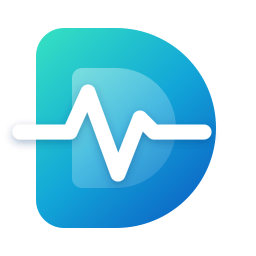
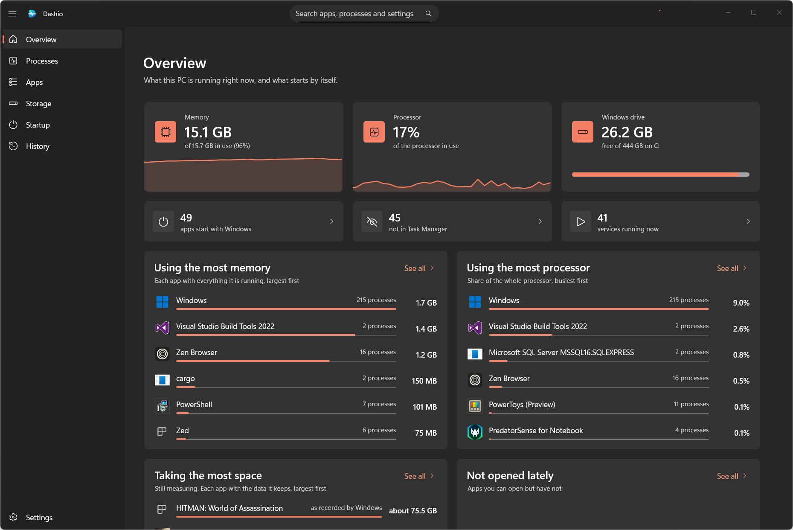
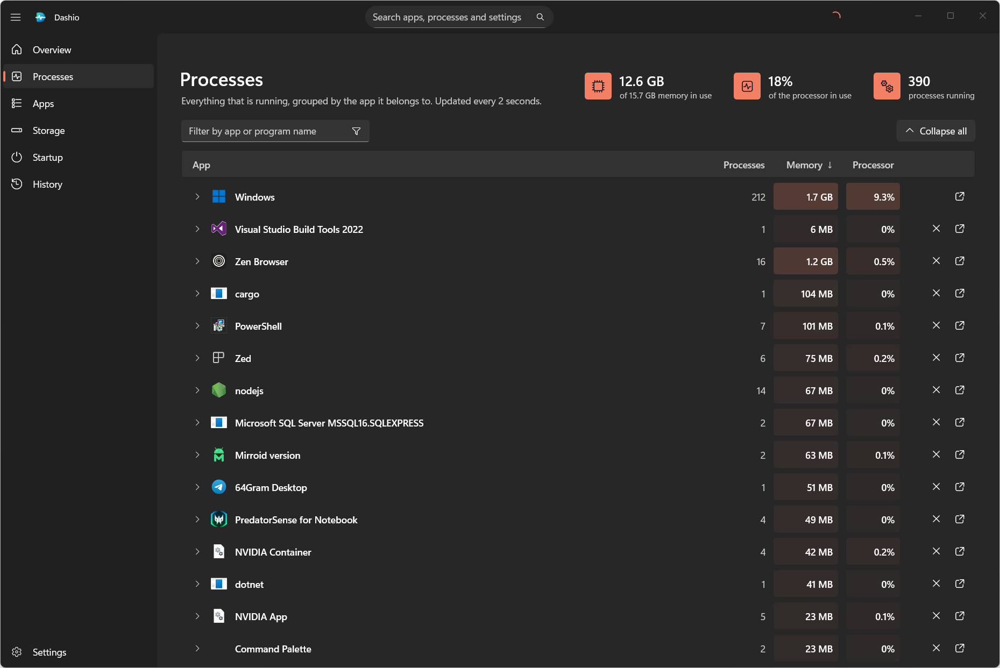
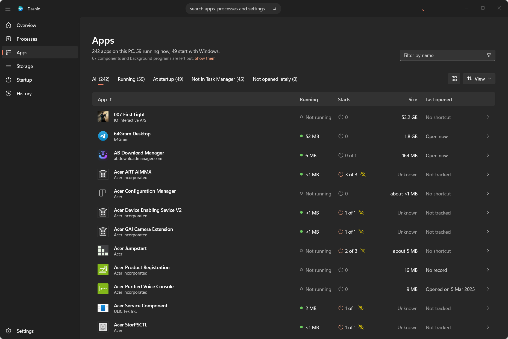
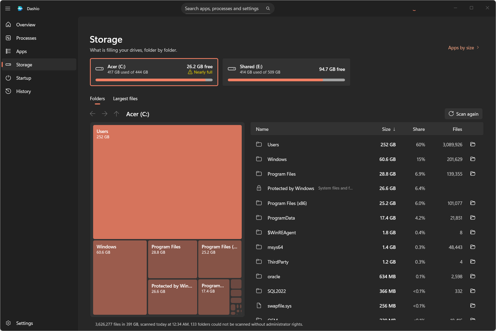
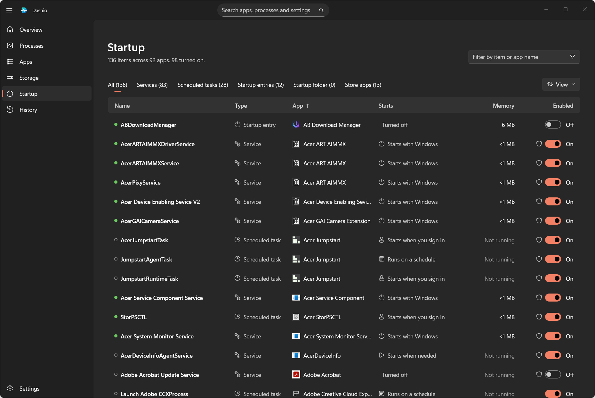

<div align="center">



# Dashio

**See what every app on your PC is doing, and switch off what it starts by itself.**

A dashboard for Windows 11: what is running, what is installed, what fills the drive and what
starts on its own, grouped by app.

Windows 11 &nbsp;·&nbsp; .NET 10 &nbsp;·&nbsp; WinUI 3 &nbsp;·&nbsp; [MIT](LICENSE) &nbsp;·&nbsp; No network, no telemetry

[The pages](#the-pages) &nbsp;·&nbsp; [Changing things](#changing-things) &nbsp;·&nbsp; [Build and run](#build-and-run) &nbsp;·&nbsp; [Privacy](#privacy)

<br>



</div>

## Why

Windows tracks services, scheduled tasks and startup entries in separate places, and Task
Manager's Startup tab only shows some of them. An app can install four services and a
scheduled task and appear nowhere in that tab. Dashio puts all of an app's pieces on one
page.

Switching things off and on is all Dashio does to them: it never deletes an item, every change
is recorded, and any change can be undone. It can also end a running program, start an app's
own uninstaller and delete a file or folder you pick on the Storage page. Those are recorded
too, but cannot be undone from Dashio.

<table>
  <tr>
    <td width="50%"><br><p align="center"><b>Processes</b><br>Every program, grouped by app</p></td>
    <td width="50%"><br><p align="center"><b>Apps</b><br>Running, startup, size and last opened</p></td>
  </tr>
  <tr>
    <td width="50%"><br><p align="center"><b>Storage</b><br>A map of each drive you can walk into</p></td>
    <td width="50%"><br><p align="center"><b>Startup</b><br>Services, tasks and startup entries</p></td>
  </tr>
</table>

## The pages

| Page | What it answers |
|---|---|
| Overview | How is this PC doing? Memory, processor and disk, and the apps using the most. |
| Processes | What is running right now? Every program, grouped by app, with End. |
| Apps | What is on this PC? One row per app: running, what it starts, size, last opened. |
| Storage | What is taking space? A map of each drive's folders that you can walk into. |
| Startup | What starts by itself? Services, scheduled tasks and startup entries, with a switch each. |
| History | What did I change? Every change, with undo. |

What is installed and what starts by itself is read when Dashio opens and again when you come
back to it after a few minutes; F5, or Settings, reads it at once. The search box in the title bar (Ctrl+E) finds an app, a running program, a startup item, a
page or a setting by name and goes there. Each list also has a filter box of its own (Ctrl+F).

## What it reads

| Kind | Where it comes from |
|---|---|
| Services | The Service Control Manager (kernel drivers are left out) |
| Scheduled tasks | Task Scheduler |
| Startup entries | The `Run` registry keys, for you and for all users |
| Startup folder | Your Startup folder and the all-users one |
| Store app startup | Startup tasks declared by Store packages |

Parts of Windows itself are recognised by their signature, hidden by default and read-only.

## What is running

Overview and Processes show memory and processor use for the whole PC and for each app, updated
every two seconds (the interval can be changed or paused in Settings). An app's figure is the
sum of everything it is running: its windows, its background programs and its services. Press
an app on the Processes page to see each of its processes.

The cells behind the figures are tinted more strongly the more an app uses, as in Task Manager.
The Processes list is put in order when you open the page or press a column heading. Between
those moments the figures change in place and rows stay where they are, so a row never moves
from under the pointer.

Memory is the private working set, the same figure Task Manager's Memory column shows.
Processor use is the share of the whole processor. Dashio reads these for every process
without administrator rights, and measures nothing while its window is minimised.

A running program is tied to an app by the services it hosts, the folder it runs from or its
signature, never by a shared word in its name.

## What is installed

The Apps page lists every app: the ones Windows shows as installed and the ones that start
something by themselves. Press the Size heading for the largest first.

Two kinds of entry are left out until you ask for them ("Show them" under the title, or the View
menu): the parts other software needs, such as runtimes, redistributables, drivers and codecs,
when they start nothing by themselves; and programs that are running without being installed,
which the Processes page shows. A part is only recognised when it says what it is, by a word in its name
(the list is `componentWords` in `attribution-overrides.json`) or by being a Store package with
nothing to open, so a game opened from its launcher or a
command-line tool stays in the list. Entries with the same name from the same maker, such as
three versions of one SDK, are one row. The filter box finds a left-out entry by name.

**Size** is the app's own folder plus the data it keeps elsewhere: a Store app's data folder,
and folders in your app data that carry the app's name or hold its files. Data that cannot be
tied to one app is left out, so a figure can be low but should not be padded. Folders are
measured in the background and remembered for twelve hours. An app with no folder to measure
shows the size Windows recorded when it was installed, marked "about".

**Last opened** is about the app itself, not its background services. Only apps with something
to open, a Start menu shortcut or a Store app entry, are judged, so drivers and runtimes are
never called unused. Dashio uses what it can:

- the apps it sees open while it is running, which it remembers;
- Windows' own list of launched apps, when Windows is still keeping it (on some PCs it is not);
- the list of programs Windows has run lately, which needs administrator access ("Grant access").

"Not opened lately" only appears when one of the last two can vouch for it, and it says how far
back the records go.

**Uninstall**, on an app's page and in its right-click menu, starts the uninstaller the app
registered with Windows, the same one Windows Settings starts, after asking. A Store app is
removed by Windows directly, which takes about half a minute when the app is running. Dashio
removes nothing itself. A banner stays for as long as the removal is underway, and Dashio says
"Uninstalled" only once Windows no longer lists the app. If the uninstaller is closed without
removing anything it says that instead. An uninstall that
ends while Dashio is not looking, because Dashio was closed or the uninstaller handed over to a
launcher, is recorded the next time Dashio reads what is installed.

## What fills a drive

Storage shows every fixed drive with how full it is. "Scan this drive" goes through every folder
on it and shows the result as a map, each folder a tile as large as what it holds, beside a list
with sizes, shares and file counts. Press a tile or a line to go into that folder; Back, Forward,
Up and the path at the top lead out again. "Largest files" lists the biggest files anywhere on
the drive.

How long a scan takes depends on whether Windows has the drive's folders in memory: seconds
when it has, a few minutes for a few million files when it has not. Ticking **Scan as
administrator**, under "Scan this drive" and again when you choose "Scan again", does not depend
on that. It reads the drive's file table directly, the one place where the drive records every
file's name, folder and size, which takes seconds and also covers the folders Windows will not
let an ordinary program list.

A scan only looks: it opens no file and changes nothing. Without administrator rights the
protected folders, such as other people's profiles, are counted together as "Protected by
Windows", so the total still matches what the drive reports. A folder's largest files are listed
by name and the rest are one line ("1,532 other files"). Files kept in the cloud count as nothing
until they are downloaded.

The last scan of each drive is kept in `%LOCALAPPDATA%\Dashio\drives`, so the page has
something to show the next time. It holds folder names and sizes and never leaves the PC.
Deleting that folder while Dashio is closed makes it forget them.

**Delete**, in the right-click menu of a folder or file, asks first and then moves it to the
Recycle Bin, or deletes it for good if you tick that. It runs with your own rights, never as
administrator, and refuses a whole drive, Windows, and the folders that hold your programs or
your profile. It is recorded in History.

How much room each app takes is a column of the Apps page.

## Ending what is running

**End app** closes everything an app is running, and **End** on a single process closes just
that one. Dashio asks first. It then asks the app's windows to close, waits a few seconds, and
ends whatever is still running. An app's running services are stopped properly first, which
needs the administrator prompt.

Parts of Windows cannot be ended, and neither can Dashio itself. Ending is recorded in History
but cannot be undone: the app can simply be opened again.

## How items are matched to apps

No single clue is enough, so Dashio applies five rules in order and records which one placed
each item. Expand an item to see the reason.

1. The file is inside a Store package.
2. The file is inside an installed app's folder.
3. The file was installed by a driver package.
4. The file sits in a vendor or product folder, such as `Program Files\Vendor\Product`.
5. The file names a company, or is signed by one.

Groups that are the same product under different names are then merged, and a short
overrides file (`src/Dashio.Core/Attribution/attribution-overrides.json`) fixes vendors whose
files describe themselves badly. Anything Dashio cannot place goes into "Unmatched" instead of
being guessed.

## Changing things

Flipping a switch queues a change; nothing happens until you choose **Review and apply**.
Changes to your own startup entries apply directly. Changes to services, machine-wide entries
and most tasks need administrator rights, so Windows shows one admin prompt per batch.

| Kind | Off means |
|---|---|
| Service | Start type set to Disabled, and the service stopped |
| Scheduled task | Disabled in Task Scheduler |
| Startup entry, Startup folder | The same on/off flag Task Manager uses |
| Store app startup | The startup task set to disabled |

A running service can also be stopped on the spot with **Stop**, which leaves its start setting
alone; undoing that starts it again.

After applying, Dashio reads each item back from Windows to confirm the change took effect.
Every change is written to `%LOCALAPPDATA%\Dashio\journal.jsonl`, and **History** can undo any
entry. Undoing a service restores its exact start type.

The Startup page also shows what each item's program is using right now, so "starts by itself"
comes with what that costs. An item an app has added since Dashio first looked is marked
**New** for two weeks, and Overview says when there are any.

Some scheduled tasks are invisible to ordinary apps. **Settings → Scan with administrator
rights** lists them, including tasks that are in the registry but hidden from Task Scheduler.

## Privacy

Dashio never connects to the internet and collects nothing. To report a security problem, see
[SECURITY.md](SECURITY.md).

## Build and run

Requirements: Windows 11 22H2 or later, the .NET 10 SDK, and the
[WinApp CLI](https://github.com/microsoft/WinAppCli) for the UI tests.

```powershell
dotnet build Dashio.slnx
dotnet run --project src\Dashio.App
```

The app is unpackaged on purpose: a packaged app's registry changes go to a private copy and
would not affect the real startup entries.

## Tests

```powershell
# Unit tests: pure logic, no access to the system.
dotnet test tests\Dashio.Core.Tests --filter "Category!=Live&Category!=Integration&Category!=Report"

# Live tests: read-only checks against this machine, including the match rate.
dotnet test tests\Dashio.Core.Tests --filter "Category=Live"

# Integration tests: create a throwaway startup entry and task for the current user,
# switch them off and on, then remove them. No administrator rights needed. With Developer
# Mode on, they also register a throwaway Store-style package and uninstall it.
dotnet test tests\Dashio.Core.Tests --filter "Category=Integration"

# UI tests: drive the real window, kept off the screen and out of the way. Build first.
pwsh tools\ui-tests.ps1
```

`Category=Report` prints what the scan sees on this machine, for reading rather than asserting.

## Layout

| Project | What it holds |
|---|---|
| `src/Dashio.Core` | Collectors, the matching engine, change logic and the change log. No UI. |
| `src/Dashio.App` | The WinUI 3 window. Never runs as administrator. |
| `src/Dashio.Helper` | A small program that runs elevated for one batch of changes, then exits. |
| `tests/Dashio.Core.Tests` | The tests above. |
| `tools` | The UI test script with its focus watchdog, the publish script and the icon generator. |

## Status

Working today: what is running, what starts by itself, what is installed and how much room it
takes, with switch off, switch on, end and undo. Planned next: alerts for new startup items and
an export. There is an installer (`tools\publish.ps1`); the builds are not signed yet.

## License

[MIT](LICENSE)
